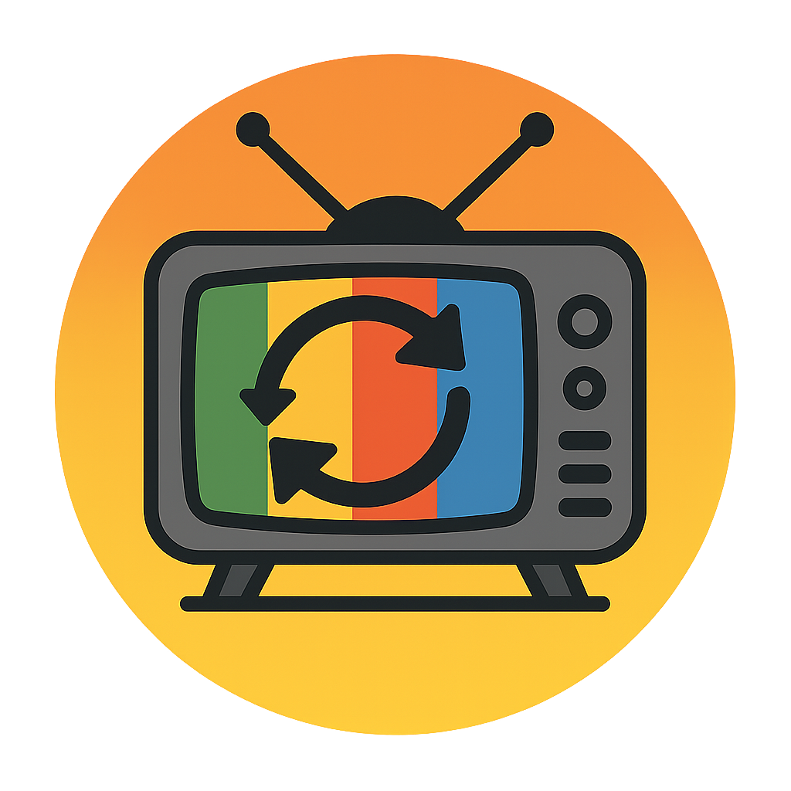

<h1 align="center">
emby-tvheadend-updatarr
</h1>

	
	
	

    

## ℹ️ About
A simple .net application which enforces a refresh of the tvheadend plugin in emby. Reason for this solution is that the tvheadend plugin doesn't natively have refresh functionality.

## 🏃‍➡️ How to run
Mandatory environment variables
 - EMBY_TVHEADEND_UPDATARR_CRON
 - EMBY_API_KEY
 - EMBY_SERVER_BASE_URL

Optional environment variables
 - RUN_ONCE

## 🐋 Docker image
wenzzzel/emby-tvheadend-updatarr on [docker hub](https://hub.docker.com/repository/docker/wenzzzel/emby-tvheadend-updatarr/general)